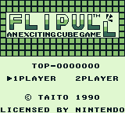

Flipull disassembly
===================

A simple disassembly of Flipull for Game Boy. Work in progress.



Assembling
----------

You'll need [RGBDS](https://github.com/rednex/rgbds). Then just run

```
make
```

and it will create `flipull_us.gb` and `flipull_jp.gb`, which should be identical to the official ROMs (compare MD5 sums to verify).

Why?
----

* For fun (it's a simple game without an MBC, so it should be fairly easy to disassemble)
* To investigate why the game reaches a kill screen on level 49, and maybe fix it
